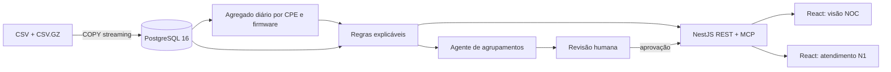

# Arquitetura proposta

## Objetivo e volume

O sistema deve detectar problemas antes de o suporte escalar, localizar o alcance (cliente, grupo ou rede) e explicar a recomendação. Com um Inform a cada duas horas, **300 mil CPEs produzem cerca de 3,6 milhões de eventos por dia**, com média nominal de aproximadamente 42 eventos por segundo e picos muito maiores após falhas elétricas ou de rede.

O desenho separa três responsabilidades:

1. processamento determinístico de todos os Informs;
2. investigação contextual de candidatos delimitados;
3. confirmação humana antes de qualquer ação no parque.

O modelo de linguagem não processa cada Inform e não controla dispositivos. Regras e agregações funcionam mesmo quando o agente estiver indisponível.

## Dashboard adaptativo: controle e dados separados

O dashboard usa IA no plano de apresentação, não no transporte contínuo dos dados:

1. o bridge `/mcp/openapi` deriva do contrato Swagger as ferramentas MCP e seleciona para o compositor apenas operações REST marcadas com `x-dashboard-resource` e `x-read-only`;
2. o modelo recebe um catálogo compacto com método, rota, finalidade, parâmetros e schema de resposta, além do objetivo escrito pelo usuário;
3. a resposta contém somente o plano visual: ordem, tamanho, tipo de bloco e um binding de uma lista fechada;
4. o frontend busca os valores reais por REST em `/api/network/overview`, `/api/incidents` e `/api/tickets/noc-queue`;
5. o layout é reutilizado durante o dia e os dados são renovados no intervalo definido, sem nova chamada ao modelo.

Essa separação evita transformar telemetria, tickets ou listas de clientes em tokens. O Swagger UI em `/api/docs` atende pessoas, enquanto `/api/openapi.json` é o contrato canônico consumível pelo editor e por geradores. Também reduz a superfície para alucinação: o modelo não escreve números e não cria uma URL arbitrária; ele escolhe apenas bindings compatíveis validados pelo backend. Uma nova chamada OpenAI ocorre somente quando o usuário pede outra composição. Sem chave configurada, o backend retorna uma composição determinística identificada como demonstração, sem simular uso de IA.

## Protótipo entregue

O `data-loader` valida os quatro arquivos, faz `COPY FROM STDIN` sem carregar o GZIP inteiro em memória, cria índices e o agregado diário. A carga é idempotente por chave de dataset. O Compose inicia a API somente após a carga e o front-end somente após o healthcheck da API.

Escolhi PostgreSQL no protótipo porque:

- os sinais exigem joins entre inventário, telemetria, chamados e diagnósticos;
- SQL torna as evidências auditáveis e reproduzíveis;
- o volume fornecido cabe em uma instância local;
- um único banco reduz a complexidade da entrega executável.

A tabela bruta de Informs é `UNLOGGED` porque deriva de um arquivo imutável e pode ser reconstruída. Inventário, chamados, diagnósticos, carga e agregados usam persistência normal. Os chamados mantêm também `source_payload` em JSONB: a camada normalizada atende a operação, enquanto o registro bruto/contextual fica disponível para auditoria e análises posteriores. O grão diário inclui o firmware para preservar trocas de versão no mesmo dia.

## Produção para 300 mil CPEs

```mermaid
flowchart LR
  ACS[CPE / ACS] --> Gateway[Gateway stateless]
  Gateway --> Bus[(Kafka ou Pulsar)]
  Bus --> Normalize[Normalização e enriquecimento]
  Normalize --> Raw[(Object storage / Parquet)]
  Normalize --> Hot[(Store temporal ou colunar)]
  Inventory[(Inventário e topologia)] --> Normalize
  Tickets[(Atendimento)] --> Bus
  Hot --> Detect[Regras e baselines em janela]
  Detect --> Aggregate[Agregador de incidentes]
  Aggregate --> Ops[(PostgreSQL operacional)]
  Aggregate --> Investigate[Fila de investigação]
  Investigate --> Agent[Agente + MCP read-only]
  Agent --> Validate[Proposta estruturada]
  Validate --> Human[Validação do NOC]
  Human -->|aprovação| Ops
  Ops --> API[NestJS API]
  API --> UI[NOC + N1]
  UI --> Action[Decisão operacional]
```

Kafka/Pulsar não é necessário pela média de 42 eventos por segundo; ele existe para absorver rajadas, desacoplar o ACS, permitir replay e transformar indisponibilidade de consumidores em atraso observável, não em perda.

## Fluxo do Inform até o alerta

1. **Recepção.** O gateway recebe o Inform, adiciona `provider_id`, serial, `event_time`, `received_at`, versão de schema e chave idempotente. A resposta ao ACS ocorre após a gravação no barramento.
2. **Normalização.** Adaptadores por fabricante/modelo/firmware convertem nomes e unidades. Eventos incompatíveis vão para quarentena; a CPE não bloqueia a ingestão das demais.
3. **Enriquecimento temporal.** O evento recebe plano, firmware e caminho OLT → PON → CTO válidos no instante observado, sem usar apenas o inventário atual.
4. **Persistência.** O bruto vai para object storage em Parquet particionado por provedor/data. Métricas normalizadas e agregados recentes vão para ClickHouse ou TimescaleDB. Estado de incidentes e ações permanece em PostgreSQL.
5. **Detecção.** Processadores mantêm janelas por CPE, firmware, CTO, PON, OLT, região e provedor. Regras determinísticas cobrem limites conhecidos; baselines robustos detectam mudança relativa ao histórico.
6. **Candidato.** Sinais equivalentes tornam-se um candidato por `provider_id + tipo + escopo + janela`. O escopo pode ser parque, OLT, PON, CTO, cliente, firmware, equipamento ou região.
7. **Investigação.** Para casos delimitados, o agente começa pelo ranking de candidatos e consulta detalhes via MCP somente leitura. O orquestrador impõe tempo, custo, escopo, número de ferramentas e tamanho de respostas.
8. **Proposta.** A conclusão precisa obedecer a um schema versionado e conter alcance, evidências rastreáveis, contraindícios, confiança e ação recomendada. Resultado incompleto permanece inconclusivo; o agente não grava incidentes.
9. **Validação humana.** O NOC confirma ou descarta na seção **Onde agir primeiro**. Ao aprovar, o backend recalcula o alcance no inventário e cria o agrupamento ativo pela API REST.
10. **Entrega.** O N1 recebe o protocolo do agrupamento quando consulta um cliente pertencente ao alcance aprovado. Reboot, rollback, configuração ou ordem de serviço continuam fora do ciclo automático.

Ausência de Inform é inferida por temporizador, porque não existe um evento de “não recebimento”. Eventos atrasados são tratados por `event_time`, watermark e janela de tolerância.

## Detecção e prioridade

O score de produção deve combinar fatores visíveis: alcance, severidade técnica, crescimento sobre baseline, custo/risco de churn e confiança. Alertas exigem duração mínima ou múltiplas CPEs; histerese e cooldown evitam abre/fecha repetido.

Exemplos:

- **CPE:** Rx abaixo de -27 dBm em leituras consecutivas sem cluster compartilhado;
- **grupo:** FEC e ausência de Inform acima do baseline em uma PON/CTO;
- **firmware:** memória e reinícios piores na nova versão do que no controle;
- **produto:** plano contratado acima da capacidade negociada da interface.

Cada incidente conserva a regra e sua versão, janela, amostras, evidências, contraindícios e explicação do score.

## Decisões e alternativas descartadas

| Decisão                              | Alternativa descartada                       | Motivo                                                                                                 |
| ------------------------------------ | -------------------------------------------- | ------------------------------------------------------------------------------------------------------ |
| Agregado diário no protótipo         | Consultar 5,5 milhões de linhas em cada tela | Latência e custo sem ganho para sinais que evoluem em horas ou dias.                                   |
| Regras explicáveis                   | ML supervisionado como decisão principal     | Não há rótulo causal confiável; as categorias e resoluções dos chamados têm ruído.                     |
| PostgreSQL local                     | MongoDB                                      | As consultas são relacionais e multidimensionais; documentos duplicariam inventário e topologia.       |
| Barramento em produção               | Gravar o Inform direto no banco              | Acoplaria o ACS ao armazenamento e não absorveria tempestades de reconexão.                            |
| Store analítico separado em produção | Escalar apenas PostgreSQL transacional       | Milhões de eventos diários e agregações por muitas dimensões favorecem armazenamento temporal/colunar. |
| Incidentes agregados                 | Um alerta por CPE                            | Evita fadiga do operador e aponta onde agir.                                                           |
| Agente apenas após pré-filtro        | Enviar cada Inform ao modelo                 | Mantém custo, latência, privacidade e disponibilidade sob controle.                                    |
| Aprovação humana                     | Ações remotas automáticas                    | O protótipo ainda não possui controles operacionais suficientes para autorizar impacto no cliente.     |

## Confiabilidade, segurança e operação

- contrato de schema e quarentena por fabricante/versão;
- idempotência, offsets, replay e dead-letter queue;
- multi-tenant por `provider_id`, RBAC e escopo por provedor;
- TLS, criptografia em repouso e retenção mínima para dados identificáveis;
- auditoria de regra, evidência, revisão humana e ação remota;
- SLOs para ingestão, completude, detecção e falsos alertas;
- cotas por provedor e circuit breaker para modelo e ferramentas;
- rollout canário para regras e firmware;
- nenhuma credencial, autorização ou restrição de escopo delegada ao prompt.

## Deliberadamente fora do escopo do protótipo

- executar reboot, rollback ou alteração de configuração automaticamente;
- autenticação/SSO, multi-provedor e permissões finas;
- ingestão TR-069 online; a entrega usa o snapshot fornecido;
- alta disponibilidade, backup e disaster recovery locais;
- mapa geográfico, notificações externas e ordem de serviço automática;
- treinamento de ML, previsão de churn e correlação com clima/energia;
- operação do agente sem chave OpenAI e sem revisão humana.

Esses itens são necessários antes da produção, mas não aumentariam a qualidade da decisão demonstrada no recorte. A primeira evolução é tornar a detecção incremental mantendo o mesmo contrato de incidente consumido pelas telas.
