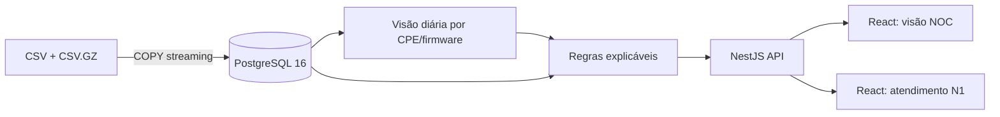
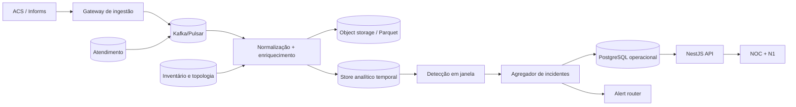

# Arquitetura proposta

## Objetivo e volume

O sistema deve detectar problemas antes de o suporte escalar, localizar o alcance (cliente, grupo ou rede) e explicar a recomendação. Com Inform a cada duas horas, **300 mil CPEs produzem cerca de 3,6 milhões de eventos por dia**, com picos de reconexão muito acima da média após falhas elétricas ou de rede.

## Protótipo entregue

O `data-loader` valida a presença dos quatro arquivos, faz `COPY FROM STDIN` sem descompactar o arquivo inteiro em memória, constrói índices e uma visão materializada diária. A carga é idempotente por chave de dataset. O Compose só inicia a API depois do término bem-sucedido da carga e só inicia o front-end depois do healthcheck da API.

Escolhi PostgreSQL no protótipo porque:

- os sinais úteis dependem de joins entre inventário, telemetria, chamados e diagnósticos;
- SQL torna as evidências auditáveis e fáceis de reproduzir;
- o volume fornecido cabe confortavelmente em uma instância local;
- reduz o número de componentes necessários para uma entrega executável.

A tabela bruta de Informs é `UNLOGGED`: no protótipo ela é derivada de um arquivo imutável e pode ser reconstruída. Inventário, chamados, diagnósticos, controle de carga e agregados usam persistência normal. O grão diário inclui o firmware porque uma CPE pode mudar de versão no meio do dia.

## Produção para 300 mil CPEs

### Fluxo do Inform ao alerta

1. **Recepção.** O ACS envia o Inform para um gateway stateless. Cada evento recebe `provider_id`, `serial`, timestamp de ingestão e chave de idempotência. A resposta ao CPE não espera a análise.
2. **Fila.** Kafka ou Pulsar absorve picos, preserva a ordem por CPE e permite reprocessamento. Uma dead-letter queue retém eventos inválidos.
3. **Normalização.** Um consumidor aplica contrato por fabricante/modelo/firmware. Aqui ocorre a conversão de potência óptica: Kestrel em milésimos de dBm, Tuim em dBm e Norvik em mW para dBm. O evento é enriquecido com plano e topologia válidos naquele instante.
4. **Persistência.** O evento bruto vai para object storage em Parquet particionado por provedor/data. Métricas normalizadas e agregados recentes vão para ClickHouse ou TimescaleDB; incidentes, estados e ações ficam em PostgreSQL.
5. **Detecção.** Processadores mantêm janelas por CPE e por dimensões compartilhadas (firmware, PON, CTO, OLT, bairro). Regras determinísticas cobrem limites conhecidos; baselines robustos detectam mudança relativa ao histórico do próprio grupo.
6. **Agrupamento.** O agregador impede uma tempestade de alertas: 60 CPEs com FEC na mesma PON viram um incidente de rede, não 60 alertas. O incidente registra evidência, alcance, confiança, custo e runbook.
7. **Entrega.** O alert router envia apenas severidades acionáveis; a API alimenta as visões NOC/N1. Toda mudança de estado e ação remota é auditada.

### Detecção e prioridade

O score deve combinar cinco fatores visíveis ao operador: alcance, severidade técnica, crescimento sobre baseline, custo/risk de churn e confiança. Um alerta só abre após duração mínima ou múltiplas CPEs, evitando ruído. Histerese e cooldown controlam abre/fecha repetido.

Exemplos:

- **CPE:** Rx abaixo de -27 dBm por leituras consecutivas;
- **grupo:** aumento de FEC e ausência de Inform em uma PON/CTO acima do baseline;
- **firmware:** queda de memória e boots significativamente maiores na versão nova que no controle;
- **produto:** plano acima da capacidade negociada da interface.

As regras e seus limites são versionados. Cada incidente conserva a versão da regra, as amostras e a explicação que levou ao score.

## Decisões e alternativas descartadas

| Decisão                              | Alternativa                                  | Motivo para não usar agora                                                                                                                    |
| ------------------------------------ | -------------------------------------------- | --------------------------------------------------------------------------------------------------------------------------------------------- |
| Agregado diário no protótipo         | Consultar 5,5 milhões de linhas em toda tela | Latência e custo desnecessários para sinais que evoluem em horas/dias.                                                                        |
| Regras explicáveis                   | Modelo ML supervisionado                     | Não há rótulo confiável de causa; categoria e resolução dos chamados têm ruído. ML agora produziria precisão aparente e pouca auditabilidade. |
| PostgreSQL local                     | MongoDB                                      | As consultas são relacionais e multidimensionais; documentos duplicariam inventário/topologia.                                                |
| Barramento em produção               | Gravar o Inform direto no banco              | Acopla o ACS ao storage e não absorve tempestades de reconexão.                                                                               |
| Store analítico separado em produção | Escalar apenas PostgreSQL transacional       | 3,6 milhões de eventos/dia e agregações por muitas dimensões favorecem armazenamento colunar/temporal.                                        |
| Alertar incidentes agregados         | Alertar por CPE                              | Evita fadiga do único operador por turno e aponta onde agir.                                                                                  |

## Confiabilidade, segurança e operação

- contratos de schema e quarentena por fabricante/versão;
- idempotência, offsets e reprocessamento controlado;
- multi-tenant por `provider_id`, RBAC e escopo por provedor;
- TLS, criptografia em repouso e retenção menor para dados identificáveis;
- logs de auditoria para mudança de regra, reconhecimento de incidente e RPC remoto;
- SLOs para atraso de ingestão, completude, tempo até detecção e falsos alertas;
- métricas de qualidade: atraso do Inform, campos ausentes, cardinalidade e mudança de unidade;
- rollout canário para regra/firmware e feature flags para ações remotas.

## Deliberadamente fora do escopo

- executar reboot, rollback ou alteração de configuração automaticamente;
- autenticação/SSO, gestão multi-provedor e permissões finas no protótipo;
- mapa geográfico, notificações externas e abertura automática de ordem de serviço;
- treinamento de ML, previsão de churn e correlação com clima/energia;
- ingestão TR-069 online: a entrega usa o snapshot fornecido;
- alta disponibilidade, backup e disaster recovery locais.

Esses itens são importantes para produção, mas não aumentariam a qualidade da decisão demonstrada no recorte atual. A primeira evolução seria transformar as consultas em detecção incremental e manter o mesmo contrato de incidente consumido pelas telas.
